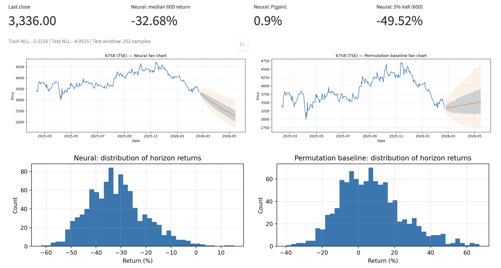

# Neural Permutation Stock Simulator (JP + US)

This is an **educational / research** project that generates *simulated* future price paths for stocks.
It uses:

- A small **LSTM neural network** that learns the conditional distribution of
  - overnight log-return `log(Open_t / Close_{t-1})`
  - intraday log-return `log(Close_t / Open_t)`
- A **bivariate Gaussian head** (mean, vol, correlation) to sample future return components
- A **permutation/bootstrapping baseline** (independent or paired sampling)
- An **experimental portfolio** mode that imposes historical cross-asset correlation by rank re-ordering.

> Important: this does **not** predict the future. It produces plausible scenarios under the model,
> which can be wrong. Not financial advice.

## Screenshots

**Sony (6758.T) — Neural vs Permutation baseline**


**NVDA — Neural vs Permutation baseline**


## Quick start

```bash
python -m venv .venv
source .venv/bin/activate   # macOS/Linux
# .venv\Scripts\activate  # Windows

pip install -r requirements.txt
streamlit run app.py
```

## Notes

- Japanese tickers can be entered as `6758` or `6758.T` (the app will add `.T` automatically).
- Some tickers may be delisted or unavailable via Yahoo Finance; those will show as "no data".

## What to look at (quant-style workflow)

- Compare the **Neural fan chart** vs the **Permutation baseline** fan chart.
- Check out-of-sample **Test NLL** (lower is better).
- Optional: run the **Permutation sanity check** to see if the model performs better than chance
  when the training targets are shuffled.
